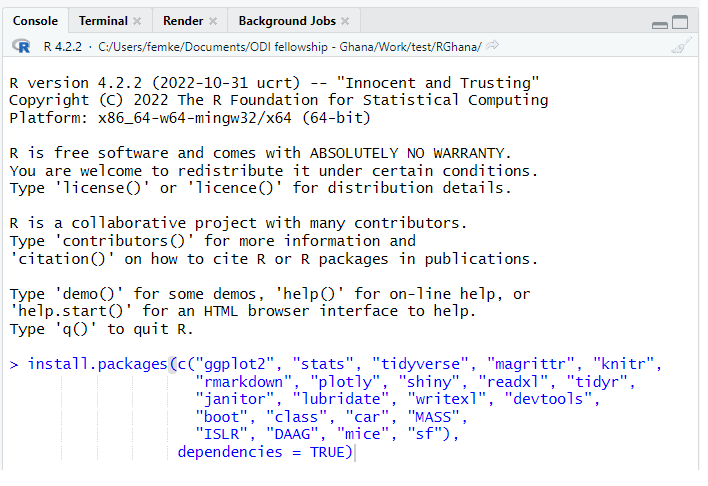

<!-- ```{r setup, include=FALSE} -->
<!-- knitr::opts_chunk$set(echo = TRUE) -->
<!-- library(vembedr) -->

<!-- ``` -->


# Intro {.sidebar}

This dashboard covers the materials for the course introducing R, and using it for CPI and trade statistics at GSS. The course is held from January 30 until February 3, 2023.

---

Instructors: 

 - Femke
 - Peter
 - Simon
 - Laurent


---

Material adopted from [Gerko Vink](https://github.com/gerkovink/R), Statistics Denmark and [Laurent Smeets](https://github.com/Laurent-Smeets-GSS-Account/RGhana).


---
# Quick Overview

## Column 1

### Outline
R is rapidly becoming the standard platform for data manipulation, visualization and analysis and has a number of advantages over other statistical software packages. A wide community of users contribute to R, resulting in an enormous coverage of statistical procedures, including many that are not available in any other statistical program. Furthermore, it is highly flexible for programming and scripting purposes, for example when manipulating data or creating professional plots. However, R lacks standard GUI menus, as in SPSS for example, from which to choose what statistical test to perform or which graph to create. As a consequence, R is more challenging to master. Therefore, this course offers an introduction to statistical programming in R. Students learn to operate R, make plots, and do advanced statistical programming and data manipulation. 


The course starts at a very basic level and builds up gradually. No previous experience with R is required.

## Column 2

### Course schedule 
| Day         | Hours       | Topic                               | 
|:------------|:------------|:------------------------------------|
| *Monday*    | 9.30-13.30 | Introduction to R and RStudio  (A)   |
|             | 14.15-17.00 | Basics of R (B) |
| *Tuesday*   | 9.30-13.30 | Data manipulation (C)               |
|             | 14.15-17.00 | Data manipulation (C)            |
| *Wednesday* | 9.30-13.30 | Analyzing data (D)      |
|             | 14.15-17.00 | Analyzing data (D)  |
| *Thursday*  | 9.30- 17.00 | Specific sessions: CPI / Trade  |
| *Friday*  |   9.30-17.00  | Specific sessions: CPI / Trade |


# Installing R + RStudio

## Column 1

### **1. Install `R`**
`R` can be obtained [here](https://cran.r-project.org). We won't use `R` directly in the course, but rather call `R` through `RStudio`. Therefore it needs to be installed. 

### **2. Install `RStudio` Desktop**

Rstudio is an Integrated Development Environment (IDE). It can be obtained as stand-alone software [here](https://www.posit.co/downloads/). The free and open source `RStudio Desktop` version is sufficient.

### **3. Start RStudio and install the following packages. **

Execute the following lines of code in the console window:

```{r eval=FALSE, echo = TRUE}
install.packages(c("ggplot2", "stats", "tidyverse", "magrittr", "knitr", 
                   "rmarkdown", "plotly", "shiny", "readxl", "tidyr", 
                   "janitor", "lubridate", "writexl", "devtools", 
                   "boot", "class", "car", "MASS", 
                   "ISLR", "DAAG", "mice", "sf"), 
                 dependencies = TRUE)
```


If you are not sure where to execute code, use the following figure to identify the console:

<center>
  
</center>

Just copy and paste the installation command and press the return key. When asked 

```{r eval = FALSE, echo = TRUE}
Do you want to install from sources the package which needs 
compilation? (Yes/no/cancel)
```

type `Yes` in the console and press the return key. 

# Monday

## Column 1

### Mondays's materials
We adapt the course as we go. To ensure that you work with the latest iteration of the course materials, we advice all course participants to access the materials online.

- Part A: Introduction
    - [Lecture A](Contents/Material/Part A - Introduction/Lecture_A.html){target="_blank"}
    - [Practical A](Contents/Material/Part A - Introduction/Practical_A.html){target="_blank"}
    - [`notebook.R`](Contents/Material/Part A - Introduction/notebook.R){target="_blank"}
    - [`markdown.Rmd`](Contents/Material/Part A - Introduction/markdown.Rmd){target="_blank"}

- Part B: Basics of R
    - [Lecture B](Contents/Material/Part B - How is R organized/Lecture-B_november.html){target="_blank"}
    - [Practical B](Contents/Material/Part B - How is R organized/Practical_B.html){target="_blank"}
    - [Solutions to Practical B](Contents/Material/Part B - How is R organized/Practical_B_walkthrough.html){target="_blank"}
    - [`boys.RData`](Contents/Material/Part B - How is R organized/boys.RData)


## Column 2

### Useful references

- [The tidyverse style guide](https://style.tidyverse.org)

The above links are useful references that connect to today's materials. 

### About `rmarkdown`

<iframe src="https://player.vimeo.com/video/178485416?color=428bca&title=0&byline=0&portrait=0" data-external= "1"
height = "300" width="450" frameborder="0"> </iframe>

<br>
See also [this `rmarkdown` cheat sheet](Contents/Material/Part A - Introduction/rmarkdown_cheat_sheet.pdf).

# Tuesday

## Column 1

### Tuesday's materials
We adapt the course as we go. To ensure that you work with the latest iteration of the course materials, we advice all course participants to access the materials online.

- Part C: Data manipulation
    - [Lecture C](Contents/Material/Part C - Data manipulation/Lecture_C.html)
    - [Practical C](Contents/Material/Part C - Data manipulation/Practical_C_final.html)

## Column 2

### Useful references
<!-- - [The Google R style guide](https://google.github.io/styleguide/Rguide.xml) -->
- [`magrittr`](https://magrittr.tidyverse.org)
- [`R` for Data Science](http://r4ds.had.co.nz) - [Chapter 18 on pipes](http://r4ds.had.co.nz/pipes.html)
- [R-bloggers tutorial on pipes](https://www.r-bloggers.com/2017/12/pipes-in-r-tutorial-for-beginners/)
- [pipe tutorial on datacamp](https://www.datacamp.com/community/tutorials/pipe-r-tutorial)


The above links are useful references that connect to today's materials.

# Wednesday

## Column 1

### Wednesdays's materials
We adapt the course as we go. To ensure that you work with the latest iteration of the course materials, we advice all course participants to access the materials online.

- Part D: Analyzing data
    - [Lecture D](Contents/Material/Part D - Analyzing data/Lecture_D.html)
    - [Practical D](Contents/Material/Part D - Analyzing data/Practical_D_new.html)
    - [Solutions to Practical D](Contents/Material/Part D - Analyzing data/Practical_D_Solutions.html)
    - [`hs_codes.RData`](Contents/Material/Part D - Analyzing data/hs_codes.RData)

On Thursday February 2, we started the day with a lecture on tidyverse, focused on wrangling data with dplyr. The following lecture was used for that.

  - [Lecture on dplyr](Contents/Material/happy_scientist-master/dplyr/intro_to_tidyverse_dplyr.html)

## Column 2

### Useful references

- [The `ggplot2` reference page](https://ggplot2.tidyverse.org/reference/)

The above link details pretty much all you can do with package `ggplot2`.

- [Geocomputation with `R`](https://bookdown.org/robinlovelace/geocompr/)

The `sf` setup for `R` is relatively new, and a lot of material about spatial data in `R` uses the older `sp` setup. This book is an introduction to spatial data the `sf` way.

- [Create awesome HTML tables with `knitr::kable` and `kableExtra`](https://cran.r-project.org/web/packages/kableExtra/vignettes/awesome_table_in_html.html)


# CPI

## Column 1

### CPI materials
On Thursday and Friday (2-3 Feb) the CPI team has specifically focused on the R code for the CPI. 

From Tuesday until Thursday (7-9 Feb) we will focus on data visualization and apply this to the CPI data as well.

- Introduction to data visualization:
  - [Lecture Data Visualization](Contents/Material/happy_scientist-master/ggplot2/intro_to_tidyverse_ggplot2.html){target="_blank"}
  - [Practical ggplot - 1](Contents/Material/happy_scientist-master/ggplot2/exercises.Rmd){target="_blank"}
  - [diabetes.csv](Contents/Material/happy_scientist-master/ggplot2/diabetes.csv)

- Recap: Data visualization
    - [Recap Lecture ggplot](Contents/Material/Part E - Data visualization/Lecture_E_new.html){target="_blank"}
    - [Practical ggplot - 2](Contents/Material/Part E - Data visualization/Practical_E_webex_ggplot.html){target="_blank"}


## Column 2

### Schedule
| Day         | Hours       | Topic                               | 
|:--------------|:------------|:------------------------------------|
| *Tuesday*  |  9.30 - 13.30  | Data visualization - Lecture |
|   |  14.15 - 17.00  | Data visualization - Practical |
| *Wednesday*  |   9.30 - 13.30  | Data visualization - Practical |
|   |  14.15 - 17.00 | CPI data visualizations |
| *Thursday*  |   9.30 - 13.30    | CPI data visualizations |
|   |  14.15 - 17.00 | Q&A and specific CPI questions |


# Trade

## Column 1

### Trade materials
On Thursday and Friday the Trade team will specifically focus on the R code for trade data.

- Introduction to Trade data
    - [Lecture Trade](Contents/Material/Trade/Lecture_Trade.html){target="_blank"}
- ICUMS data 
  - Reformatting
  - Cleaning and analyzing


We are using the following R scripts:
<ol>
- [Reformatting Code Exports.Rmd](Contents/Material/Trade/Trade_formatting_exports.Rmd){target="_blank"}
- [Reformatting Code Imports.Rmd](Contents/Material/Trade/Trade_formatting_imports.Rmd){target="_blank"}
- [Trade vulnerability ICUMS.R](Contents/Material/Trade/Trade vulnerability ICUMS.R){target="_blank"}
</ol>


## Column 2

### Schedule
| Day         | Hours       | Topic                               | 
|:------------|:------------|:------------------------------------|
| *Thursday*  |  9.30 - 13.30  | Introduction to trade data |
|   |  14.15 - 17.00 | ICUMS data, reformatting |
| *Friday*  |    9.30 - 13.30  | Cleaning and analysing ICUMS data |
|   |  14.15 - 17.00  | Working with the data! |


# Further studies

## Column 1

### Tips and tricks
The final tips and tricks that were discussed on Wednesday afternoon can be found here.

- [Final tips and tricks](Contents/Material/Final tips and tricks.pdf){target="_blank"}


### Additional material

The following references are currently available for free, either as pdfs or as extensive webpages (written with [RMarkdown](https://rmarkdown.rstudio.com/) and [bookdown](https://bookdown.org/)). They are all very useful and we highly recommend them. 

- [R for Data Science](https://r4ds.had.co.nz): written by Hadley Wickham and Garrett Grolemund this book relies almost exclusively on the [tidyverse](https://www.tidyverse.org/) approach to data analysis. Many highly effective tools will be right at your fingertips after reading this book and working through the many exercises.
- [Hands-On Programming with R](https://rstudio-education.github.io/hopr/): a great read by Garrett Grolemund emphasizing programming techniques with R. 
- [Advanced R](https://adv-r.hadley.nz/): You want to gain deeper knowledge of R and you wnat to learn from one of the most influential R contributors. This one is for you!
- [Introduction to Statistical Learning](http://faculty.marshall.usc.edu/gareth-james/ISL/): an introductory book on statistical learning, with applications in R. The R code is somewhat old-style and you might be able to find newer packages for the tasks, but ths is a solid read well worth the effort.
- [Data Analysis and Graphics Using R](http://www.pindex.com/uploads/post_docs/Maindonald%20Data%20Analysis%20and%20Graphics(PINDEX-DOC-6953).pdf): a detailed book that covers a lot about categorical data analysis and fitting `glm`s in `R`.
- [Happy Git and GitHub for the useR ](https://happygitwithr.com/index.html): a great introduction to version control using Git and GitHub together with RStudio. Written by Jenny Bryan in a very concise style. Highly recommended!


# After the training: Trade

## Column 1

### Introduction
As discussed at the end of the R training (30 Jan - 3 Feb) we agreed on a longer term plan to improve the R skills of the trade team. We will have weekly 2 hour long meetings to learn more in R, as well as to discuss assignments and practical issues you have while using R. Besides that, I am available for any questions, so always feel free to come by my office (332), or to text/call me to schedule a meeting.

It must be noted that your own motivation and dedication will determine how much progress you make. The more time you invest in learning R, the better you will get of course! Therefore, I would like this progress to be very much driven by what you want to learn, so please come up with topics to discuss yourself as well and I will adjust the assignments and discussions based on that.

### Material to use
Remember to always work from your Trade R folder and project on your computer. Below please find the R scripts we will work with, as well as the assignments and their solutions. 

R scripts:

- [Reformatting Code Exports](Contents/Material/Trade/Trade_formatting_exports.Rmd){target="_blank"}
- [Reformatting Code Imports](Contents/Material/Trade/Trade_formatting_imports.Rmd){target="_blank"}
- [Trade vulnerability ICUMS](Contents/Material/Trade/Trade vulnerability ICUMS.R){target="_blank"}


### Assignments + solutions
Assignments:

- [Assignment 1 (Deadline: 13-02)](Contents/Material/Trade/Assignments/Trade_Assignment_1.html){target="_blank"}

Solutions to assignments:

## Column 2
### Schedule
| Week         | Meeting day + time     | Topic         | 
|:-----------|:---------------------|:----------------------------------|
| *6-10 Feb*  |  Wednesday 13.00-15.00  | Recap of training + Assignment 1 |
|  |  OR Friday 10.00-12.00  |  |
| *13-17 Feb*  |    ...  | Discuss Assignment 1|
| *20-24 Feb*  |    ...  | Analyzing ICUMS data - go through code, part 1 |
| *27-3 Feb/Mar*  |    ...  | Discuss Assignment 2 |
| *6-10 Mar*  |    ...  | Analyzing ICUMS data - go through code, part 2 |
| *13-17 Mar*  |    ...  | Discuss Assignment 3 |


